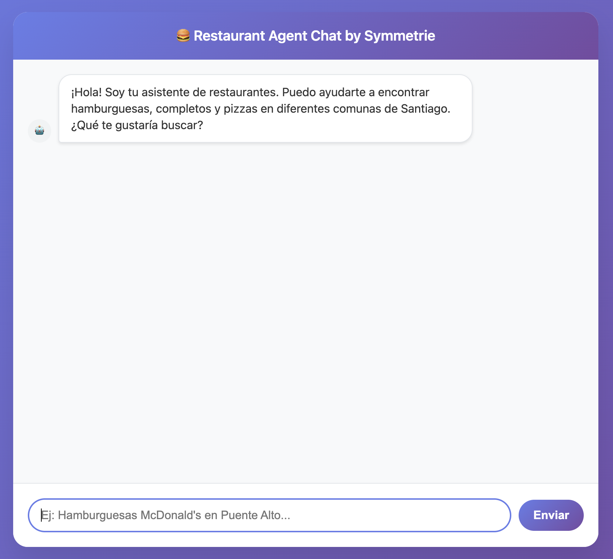

# Symmetrie Challenge

### Expected time: 2 ~ 3 hrs

### Overview

Welcome to the Symmetrie challenge! You will be asked to build an agentic system that can be used to list fast food restaurants near to a specific location. This system will use LangGraph for the agentic workflow and Milvus for data storage and retrieval.

### Starter code

A basic working FastAPI application has been included with a single websocket endpoint. You can find the backend code in the repository. Please use this as your starting point and extend it to build the agentic system by completing the TODOs.

To start up the app, first install all the dependencies with `pip install -r requirements.txt`. Then run the FastAPI server with `uvicorn main:app --reload`. You can access the frontend at `http://localhost:8000`.

Note: Milvus doesn't have support on Windows, so you will need to use WSL to run the app.



### Requirements

You will be given three lists of fast food restaurants, with their name, location, and a score. There are three types of food categories to work with:
- Hamburguesas
- Completos  
- Pizzas

Your agentic system should be able to:

- Accept user queries about the desired list of fast food restaurants in a specific location and food franchise via websocket connection
- Use LangGraph to build an agentic workflow that can process user requests
- Filter restaurants based on the location requested
- Return a list of the restaurants matching the user's criteria

Some notes:

- You can change anything in the existing code (except for the test files), but you cannot add any new dependencies beyond what's already included
- Don't incur in costs for using OpenAI or any other LLM. Agents should be able to respond using mock data and prompts
- We will NOT evaluate your solution based on the UI design, as this is primarily a backend/agent challenge.

### Testing
Once you have implemented the system, you can test it.

To test the system, run the command `pytest` or `python test_file.py` for the specific test file you want to run.

The following tests verify existing functionality and are currently passing:

* `test_query_parser.py` - Tests query parsing, food type extraction, location detection, and best/worst detection (bonus tests will fail until you implement the bonus features).
* `test_websocket.py` - Tests WebSocket endpoint.

The following tests verify your implementation and the bonus features:
* `test_queries.py` -  Tests the Milvus integration and the main agent functionality through specific queries (including the bonus questions).

You also can experiment using the frontend with queries such as:
- "Hamburguesas en Puente Alto"
- "Papas fritas en Santiago Centro"
- "Hamburguesas McDonald's en Puente Alto"
- "Pizzas Melt Costanera Center"
- "Completos Doggis"

Try with different queries and see how the system performs. This will help you to understand the system and to answer the bonus questions.


### Evaluation

We will evaluate your solution using the following assessments:

- Does the code pass the tests?
- Does it implement the core agentic functionality using LangGraph?
- Is Milvus properly integrated for data storage and retrieval?
- Is the code well-organized, easy to read, and reasonably modular?

Send us a link to a public GitHub repository with your solution. Include a README.md file with a description of the code, your solution, the main decisions made.

### BONUS
- ¿Cuál es el impacto de usar un filtro en Milvus? ¿Qué cambios harías para mejorar los resultados considerando el rendimiento? (+1 punto)
- ¿Qué cambios harías en el esquema de la base de datos vectorial para que entregue resultados más precisos? (+1 punto)
- Durante el proceso de embedding, ¿Cómo influye el largo del contenido a transformar en vector en la búsqueda vectorial? (+2 puntos)
- Extiende el sistema para permitir al usuario preguntar por los mejores y peores restaurantes en una categoría específica (Prueba con "los mejores y peores Completos Dominó Fuente de Soda Mall Plaza Norte") (+0.5 puntos)

****
### API Documentation

WebSocket endpoint: `ws://localhost:8000/ws`

Expected message format for queries:
```json
{
  "type": "query",
  "message": "Hamburguesas en Santiago Centro"
}
```

Expected response format:
```json
{
  "type": "response",
  "restaurants": [
    {
      "name": "Burger Palace",
      "street": "Downtown",
      "municipality": "Recoleta",
      "full_address": "Downtown, Recoleta, Santiago",
      "score": 9.2,
      "type": "Hamburguesas"
    }
  ],
  "explanation": "Based on your request for hamburguesas, I found these top-rated options..."
}
```

Restaurant data structure:
```json
{
  "name": "string",
  "address": "string, string, string", 
  "score": "float",
}
```
